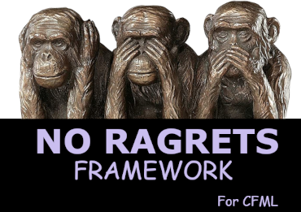

<div id="top"></div>

<!-- PROJECT LOGO -->
<br>
<div align="center">
  <a href="https://github.com/shawnoden/noragrets">
    
  </a>

<h2 align="center">No Ragrets Framework for CFML</h2>

  <p align="left">
    It was pointed out to me earlier that it has been over a decade since we've seen a new ColdFusion framework. (Thanks, Mr. Cameron.)
    <br><br>
    <a href="https://www.coldbox.org">ColdBox</a> was created in 2006.
    <br>
    <a href="https://cfwheels.org">CFWheels</a> was created in 2009.
    <br>
    <a href="https://framework-one.github.io">FW/1</a> was created in 2009.
    <br><br>
    We need a new one.
    <br><br>
    I'm too lazy and unmotivated to do all the work, but that's what Open Source Software is for, right?
    <br><br>
    I've created the repo. I've created a logo. I started the base file for the framework. I leave the rest to all of you.
  </p>
  <p align="center">
    <a href="https://github.com/shawnoden/noragrets/issues">Report A Bug</a>
    <br>
    <a href="https://github.com/shawnoden/noragrets/issues">Request A Feature</a>
  </p>
</div>

<!-- TABLE OF CONTENTS -->
<details>
  <summary>Table of Contents</summary>
  <ol>
    <li>
      <a href="#about-the-project">About The Project</a>
      <ul>
        <li><a href="#built-with">Built With</a></li>
      </ul>
    </li>
    <li>
      <a href="#getting-started">Getting Started</a>
      <ul>
        <li><a href="#prerequisites">Prerequisites</a></li>
        <li><a href="#installation">Installation</a></li>
      </ul>
    </li>
    <li><a href="#usage">Usage</a></li>
    <li><a href="#roadmap">Roadmap</a></li>
    <li><a href="#contributing">Contributing</a></li>
    <li><a href="#license">License</a></li>
    <li><a href="#contact">Contact</a></li>
    <li><a href="#acknowledgments">Acknowledgments</a></li>
  </ol>
</details>

<!-- ABOUT THE PROJECT -->
## About The Project

This project is pretty much a sarcastic response to a realization about a coding language that I've used for over 20 years. If you take this thing too seriously, then I do worry for you. But still feel free to contribute, please.

<p align="right">(<a href="#top">back to top</a>)</p>

### Built With

* [Adobe ColdFusion](https://www.adobe.com/products/coldfusion-family.html)
* [Other Cool Tools](https://www.xkcd.com)

<p align="right">(<a href="#top">back to top</a>)</p>

<!-- GETTING STARTED -->
## Getting Started

This is my problem. I find it a bit difficult to get started on this project. Hopefully you can do better.

### Prerequisites

These are the important tools you need:

* The ability to query your internal database.
  
  ```sql

  SELECT * FROM senses WHERE type='humor'
  
  ```

  If your results come back empty, you'll probably yell at me. Please don't.

### Installation

1. Clone this repo

   ```sh
   git clone https://github.com/shawnoden/noragrets.git
   ```

2. Ponder the life choices that got you roped into this.
3. Be excellent to each other.

<p align="right">(<a href="#top">back to top</a>)</p>

<!-- ROADMAP -->
## Roadmap

* [X] Build a GitHub Repo
* [X] Make a Logo
* [X] Make a mental note to never tell my wife I wasted my time on a silly joke like this
* [ ] Realize that I'm probably going to tell her anyway, so just accept her laughter at my geekiness
* [ ] Convince everyone else to do the hard stuff
* [ ] Profit

Right now, this project has *ZERO* issues. So if you find an issue, don't blame me.
<br><br>
See the [open issues](https://github.com/shawnoden/noragrets/issues) for a full list of proposed features (and known issues).

<p align="right">(<a href="#top">back to top</a>)</p>

<!-- CONTRIBUTING -->
## Contributing

Contributions are what will make this actually happen. Depending on your point of view *(and your love/hate of this language)*, you will be either appreciated or reviled. I can't take any credit for either the love or the revulsion for your contributions here. This is what Open Source is, after all.

Regardless, I'm one of the few remaining fanbois of CFML, so you will always have my appreciation. Especially if find humor in this repo.

Feel free to make any suggestions for improvements, or even better, fork this repo and submit a Pull Request.

1. Fork the Project
2. Create your Feature Branch (`git checkout -b feature/AmazingFeature`)
3. Commit your Changes (`git commit -m 'Add some AmazingFeature'`)
4. Push to the Branch (`git push origin feature/AmazingFeature`)
5. Open a Pull Request

My only request is that you at least try to find a way to use [`parameterExists()`](https://helpx.adobe.com/coldfusion/cfml-reference/coldfusion-functions/functions-m-r/parameterexists.html). It was deprecated when I began using Allaire's Cold Fusion 4.0 back in 1999 or so, and even though it refuses to die and/or won't actually be killed, it gets no love at all.
<br>
**NOTE:* Please don't actually use it. It was deprecated for a reason. But that doesn't mean you can't find some joy in the fact that it's still around.*

<p align="right">(<a href="#top">back to top</a>)</p>

## My Promise To You

This is my solemn vow to you: If you are one of the first 10,000 people to Star this repo, I will share all of the future profits with you.

Granted, I'm not a lawyer, and I haven't consulted with one to make sure this is even something I can even do. If I can't, sorry, but thanks anyway.

<p align="right">(<a href="#top">back to top</a>)</p>

<!-- LICENSE -->
## License

Originally distributed under the [MIT – No Bob Saget Open Source License](https://www.synopsys.com/blogs/software-security/bob-saget-open-source-license-compliance/). When I first saw this license, I thought it was a pretty funny addition. I was recently reminded of the existence of this license and happened to see that it was involved with a familiar name, though that person claims to not be the official author of this license. And since Mr. Saget has sadly passed on and was hopefully never unintentionally inconvenienced by this license, I feel that I should modify this license to point at a new target to inconvenience, hopefully never practically.

See `LICENSE.txt` for more information.

<p align="right">(<a href="#top">back to top</a>)</p>

<!-- CONTACT -->
## Contact

Send us a message on the Project.

Project Link: [https://github.com/shawnoden/noragrets](https://github.com/shawnoden/noragrets)

<p align="right">(<a href="#top">back to top</a>)</p>

<!-- ACKNOWLEDGMENTS -->
## Acknowledgments

* [I WON'T REVEAL WHO PUT THIS HORRIBLE IDEA IN MY HEAD](https://blog.adamcameron.me/)
* This README.md is based on a [template I found with a Google search](https://raw.githubusercontent.com/othneildrew/Best-README-Template/master/BLANK_README.md).
* Even though the Hear/See/Speak No Evil Monkeys are quite well known, the base of my logo image was taken from an Amazon item. There's apparently actually a figurine of these monkeys. Anyway, when this framework begins to be used in every household, I'll probably have to come up with a new logo.
  * Lastly, I'd like to thank the Comic Sans font for giving me the appropriate styling for my logo words. I couldn't have done it with out the awesomeness of Comic Sans.

<p align="right">(<a href="#top">back to top</a>)</p>

## I APOLOGISE

I have taken this joke way too far and wasted way too much time on a Friday evening. I blame the headache. But if you are still reading this far, and I have wasted this much of your time, then I am truly sorry. Unless you have a weird urge to contribute and help me start down the path to rewarding all of the Star Gazers here with their share of this potentially billion dollar idea.

## AND FINALLY

You Heart Matters.
